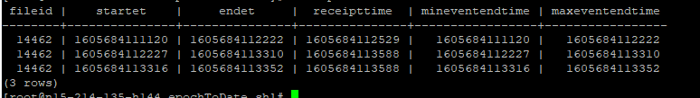
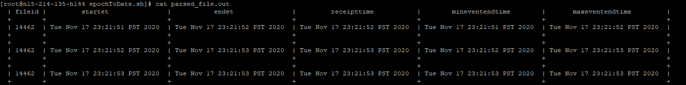

# Parser for epoch dates in a given table
- Download the inputTable.txt and epochToDate.sh under the same directory
- Setup execution privileges: chmod +x epochToDate.sh
- Usage: ./epochToDate.sh
- Requires a file called epochTable.txt with the output of your SQL query

Expected format of the epochTable.txt

Expected output: parsed_file.out

